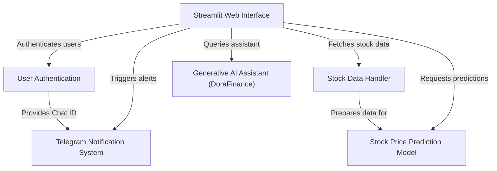
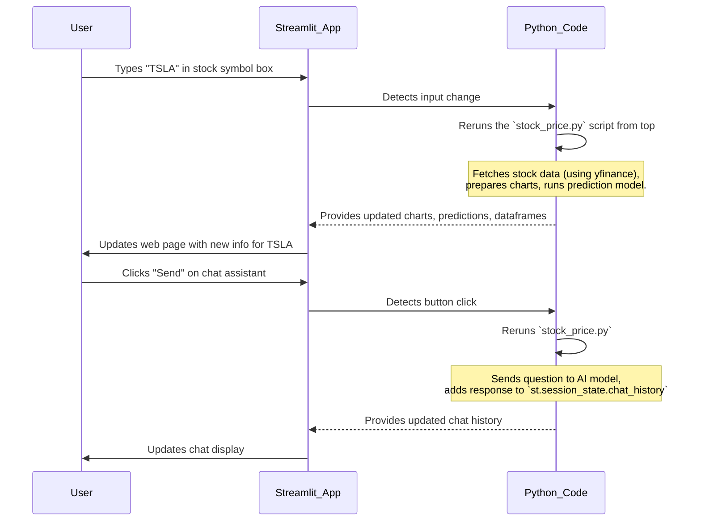
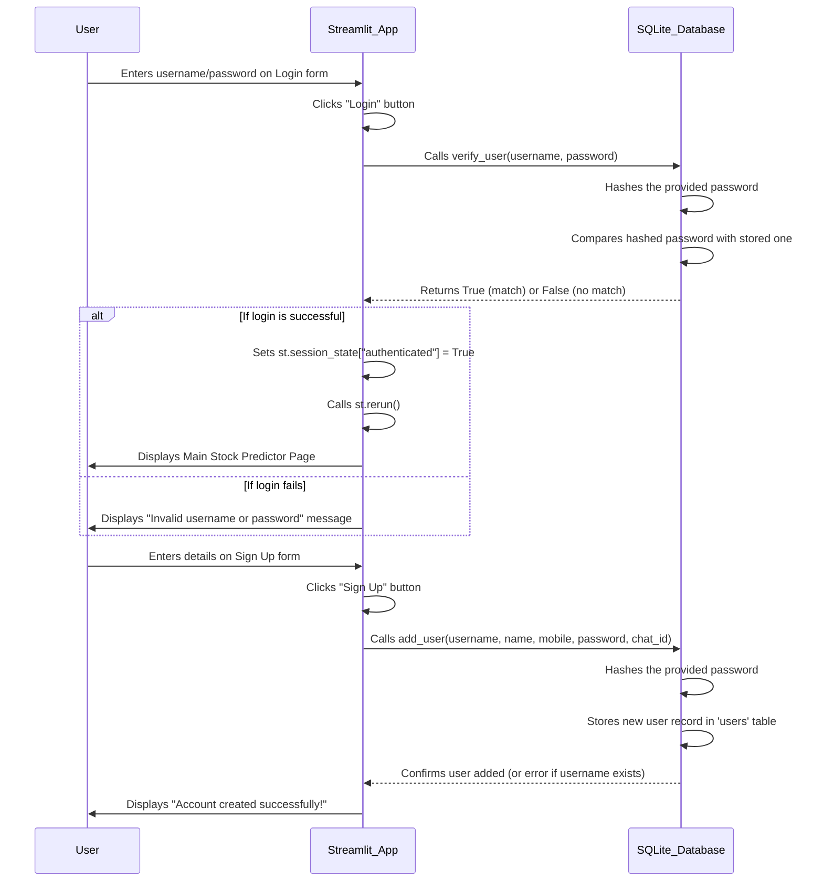
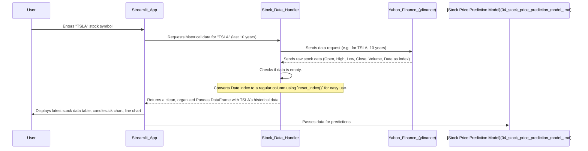
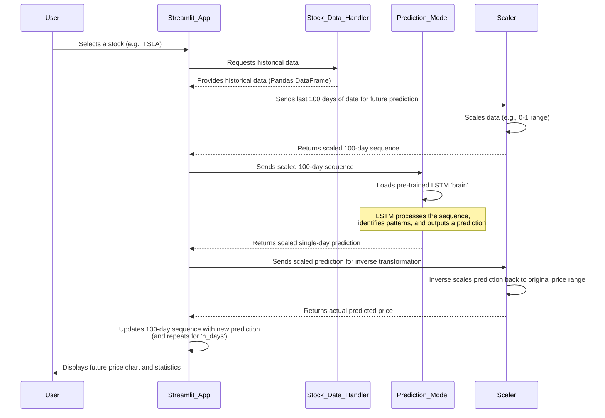
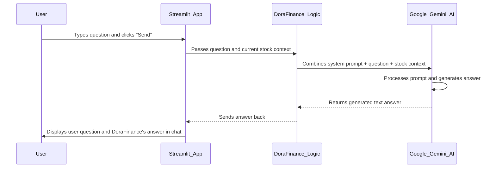
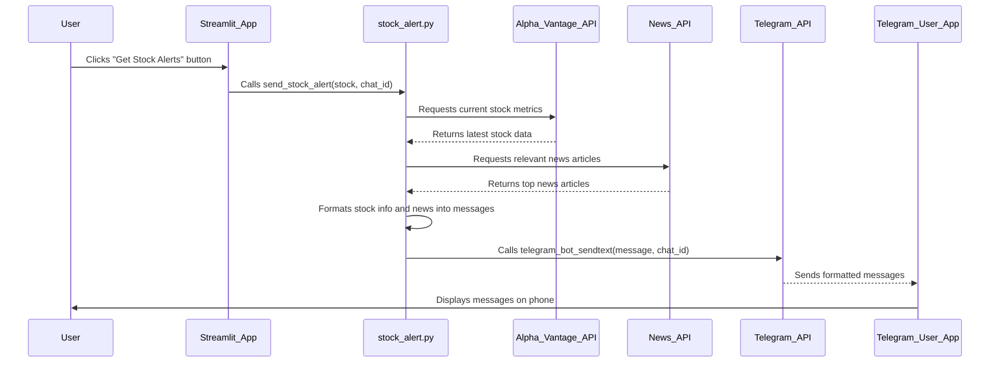

# Tutorial: Stock-Price-Predictor-with-CahtBot-and-TelegramBot-using-deep-learning-and-Gen-AI

This project provides an *AI-powered stock analysis platform* with a **web interface** for users to predict stock prices, get financial advice, and receive real-time alerts. It handles **user authentication**, fetches *historical stock data*, uses **deep learning models** for predictions, and offers an *interactive AI assistant* powered by Google Gemini, all while sending personalized **Telegram notifications**.


## Visual Overview



## Chapters

1. [Streamlit Web Interface
](01_streamlit_web_interface_.md)
2. [User Authentication
](02_user_authentication_.md)
3. [Stock Data Handler
](03_stock_data_handler_.md)
4. [Stock Price Prediction Model
](04_stock_price_prediction_model_.md)
5. [Generative AI Assistant (DoraFinance)
](05_generative_ai_assistant__dorafinance__.md)
6. [Telegram Notification System
](06_telegram_notification_system_.md)

---


# Chapter 1: Streamlit Web Interface

Welcome to the first chapter of our Stock Price Predictor project! In this chapter, we'll talk about the "Streamlit Web Interface." Think of it as the friendly face of our entire project – the part you see and interact with.

### What Problem Does Streamlit Solve?

Imagine you have some super smart AI models that can predict stock prices and a chatbot that understands your financial questions. That's amazing! But how do you, as a user, *talk* to these models? How do you tell them which stock you're interested in, or see the charts they create? You could write Python code every time, but that's not very user-friendly for most people.

This is where the Streamlit Web Interface comes in. It solves the problem of making complex tools easy to use. Instead of writing code, you get a beautiful web page with buttons, text boxes, and charts that lets you interact with all the powerful features hidden underneath.

**Central Use Case:** You want to quickly check the price prediction for a stock like "TSLA" and then ask our AI assistant a question about market trends. The Streamlit interface is what makes this simple. It's like the **dashboard of a car**: you don't need to know how the engine works to drive; you just use the steering wheel, pedals, and the screen in front of you. Streamlit builds that "dashboard" for our financial application.

### What is Streamlit?

Streamlit is a fantastic Python library that lets you build interactive web applications purely with Python code. You don't need to know complicated web languages like HTML, CSS, or JavaScript. If you know a bit of Python, you can build impressive web apps!

**Why did we choose Streamlit for this project?**

*   **Simplicity**: It's incredibly easy to learn and use, perfect for getting a visual interface up and running quickly.
*   **Speed**: You can build and deploy interactive apps in just a few lines of code.
*   **Python-Native**: Everything is done in Python, which is great for data science and AI projects because all our models are already in Python.
*   **Interactivity**: It automatically creates interactive elements (like sliders and buttons) based on your Python code.

### Key Concepts of Streamlit

Let's look at some basic building blocks of a Streamlit application that you'll see in our project:

*   **`st.title()` or `st.header()`**: Used to add big titles or section headings to your app.
*   **`st.text_input()`**: Creates a box where users can type in text, like a stock symbol (`TSLA`).
*   **`st.button()`**: Creates a clickable button. When a user clicks it, your Streamlit app can perform an action.
*   **`st.pyplot()`**: Used to display charts and graphs created using Python's `matplotlib` or `mplfinance` libraries.
*   **`st.dataframe()`**: Displays data in a nice, interactive table format, similar to a spreadsheet.
*   **`st.columns()`**: Helps arrange elements side-by-side on the page, making your layout cleaner.
*   **`st.slider()`**: Lets users select a value by sliding a bar, useful for choosing how many days to predict.
*   **`st.session_state`**: This is a crucial concept! Streamlit apps re-run their entire script from top to bottom every time a user interacts with them. `st.session_state` is how Streamlit "remembers" things across these re-runs, like whether a user is logged in, or the history of a chat conversation.
*   **`st.markdown()`**: Allows you to add text formatted using Markdown (like bold, italics, links) and even custom styling with HTML/CSS to make your app look professional.

### Building Our Interface with Streamlit

Let's see how we use these Streamlit building blocks to create our Stock Price Predictor interface. All the Streamlit-related code for the main application lives within the `stock_price.py` file.

**1. Setting Up the Page**

First, we set up some basic things about our web page, like its title and how wide it should be.

```python
import streamlit as st # This line is always needed!

# Configure the web page
st.set_page_config(page_title="📈 Stock Price Predictor + 🤖 Assistant", layout="wide")

# Add a big main title
st.markdown("<h1 style='text-align: center; color: #4a8bfc;'>📈 Stock Price Predictor & 🤖 DoraFinance Assistant</h1>", unsafe_allow_html=True)
st.markdown("<div style='text-align: center; margin-bottom: 2rem; color: #a0a0a0;'>Your AI-powered financial analysis platform</div>", unsafe_allow_html=True)
```

*   `import streamlit as st`: This is the first step in any Streamlit app – it imports the library so you can use all its functions.
*   `st.set_page_config()`: This sets the tab title in your browser and makes the page use the full width of the screen (`layout="wide"`).
*   `st.markdown()`: We use this with `unsafe_allow_html=True` to embed custom styling (CSS) for our titles and text, making them look nice and centered with specific colors.

**2. User Input: Stock Symbol**

To get the stock symbol from the user, we use `st.text_input()`:

```python
# Create two columns for better layout
col1, col2 = st.columns([3, 1])
with col1:
    stock = st.text_input("Enter Stock Symbol (e.g. AAPL, TSLA)", value="TSLA").upper()
```

*   `st.columns()`: This creates two invisible columns. The numbers `[3, 1]` mean the first column will be three times wider than the second. This helps us place the stock input and Telegram button neatly side-by-side.
*   `with col1:`: This means everything inside this `with` block will appear in the first column.
*   `st.text_input()`: This displays a text box where the user can type. The default value is "TSLA". Whatever the user types will be stored in the `stock` variable.

**3. Displaying Data: Tables and Charts**

Once we have the stock data (which is handled by the [Stock Data Handler](03_stock_data_handler_.md) behind the scenes), Streamlit makes it easy to show it.

```python
# Display a table of the latest 100 days of data
with st.expander("📜 View Latest 100 Days of Stock Data"):
    st.dataframe(data.tail(100), use_container_width=True)

# Display a candlestick chart
st.subheader("🕯 Candlestick Chart")
# ... code to prepare data for chart (not shown, as it's part of data handling) ...
import mplfinance as mpf
fig_candle, _ = mpf.plot(candlestick_data.tail(100), type='candle', style='nightclouds', volume=True, returnfig=True)
st.pyplot(fig_candle)

# Display a line chart
st.subheader("📈 Close Price Over Time")
import matplotlib.pyplot as plt
fig_line = plt.figure(figsize=(15, 5))
plt.plot(data['Date'], data['Close'], label='Close Price')
st.pyplot(fig_line)
```

*   `st.expander()`: This creates a collapsible section. The text "View Latest 100 Days of Stock Data" will be visible, and when clicked, the content inside (our dataframe) will appear.
*   `st.dataframe()`: Shows the `data` (which is a pandas DataFrame) in an interactive table. `use_container_width=True` makes it fill the available space.
*   `st.subheader()`: Adds a smaller heading.
*   `st.pyplot()`: Takes a `matplotlib` or `mplfinance` figure (like `fig_candle` or `fig_line`) and displays it as a chart on the web page.

**4. Interacting with the AI Chat Assistant**

The AI chatbot is another core feature, and Streamlit provides the interface for that too.

```python
# Chat input field
col1, col2 = st.columns([5, 1])
with col1:
    text_input = st.text_input(
        "Your Question",
        key="text_input_field",
        placeholder="Ask me about stocks, market trends..."
    )
with col2:
    st.markdown("<br>", unsafe_allow_html=True) # Just for spacing
    if st.button("Send 📤", key="send_button"):
        if text_input.strip():
            # Add user message to chat history
            st.session_state.chat_history.append(("You", text_input))
            # ... code to get response from AI (handled by Gen AI Assistant chapter) ...
            st.session_state.chat_history.append(("DoraFinance", response))
            st.rerun() # Refresh the page to show new chat
        else:
            st.warning("Please enter a question.")

# Display chat history
if st.session_state.chat_history:
    st.markdown("<div class='chat-container'>", unsafe_allow_html=True)
    for sender, message in st.session_state.chat_history:
        # Display messages (using custom CSS for styling)
        if sender == "You":
            st.markdown(f"<div class='user-message'>...</div>", unsafe_allow_html=True)
        else:
            st.markdown(f"<div class='bot-message'>...</div>", unsafe_allow_html=True)
```

*   `st.text_input()`: This is where the user types their question to the chatbot.
*   `st.button("Send 📤")`: When clicked, this button triggers the logic to send the user's question to the AI model.
*   `st.session_state.chat_history`: This is how we store and remember the conversation. Each time a message is sent, it's added to this list.
*   `st.rerun()`: Because Streamlit re-runs the whole script, `st.rerun()` tells Streamlit to immediately re-run the script after a new message is added, so the chat history updates on the screen.

### How Streamlit Works Under the Hood (Simplified)

Streamlit has a unique way of working that makes it very simple. When you run a Streamlit app, it creates a web server. Every time you interact with the app (like typing in a text box, clicking a button, or moving a slider), Streamlit does the following:

1.  **It re-runs your entire Python script from top to bottom.**
2.  **It checks for changes.** Streamlit is smart; it knows which parts of your script need to be updated based on your interactions.
3.  **It updates the web page.** Only the parts of the web page that have changed are refreshed, giving you a smooth experience.

This constant re-running is why `st.session_state` is so important. Without it, every interaction would be like starting the app fresh, and it would forget things like your login status or previous chat messages!

Here's a simple sequence of events:



### Why not traditional web development (HTML/CSS/JS)?

| Feature             | Streamlit Web Interface                       | Traditional Web Development (HTML/CSS/JS)       |
| :------------------ | :-------------------------------------------- | :------------------------------------------------ |
| **Ease of Use**     | Very easy, especially for Python users        | Steeper learning curve, requires multiple languages |
| **Development Speed** | Extremely fast for data-centric apps          | Slower, more setup time                         |
| **Language**        | Pure Python                                   | HTML (structure), CSS (style), JavaScript (interactivity) |
| **Complexity**      | Handles web complexities for you              | Requires manual handling of web elements and logic |
| **Best For**        | Data dashboards, ML apps, rapid prototyping   | Any web application, highly custom UIs          |

As you can see, Streamlit is perfect for a project like ours where we want to quickly build an interactive interface around our data analysis and AI models without getting bogged down in traditional web development complexities.

### Conclusion

In this chapter, you've learned that the Streamlit Web Interface is the user-friendly dashboard for our Stock Price Predictor. It allows users to easily input stock symbols, view dynamic charts, get price predictions, and interact with the AI chat assistant, all without needing to write any code. We explored how Streamlit simplifies web development with its easy-to-use components like `st.text_input`, `st.button`, and `st.pyplot`, and understood how `st.session_state` helps maintain the application's state across interactions.

Now that we understand how users will interact with our application, the next logical step is to secure it. In the next chapter, we'll dive into how we handle users logging in and out of the system.

[Next Chapter: User Authentication](02_user_authentication_.md)

---


# Chapter 2: User Authentication

Welcome back! In [Chapter 1: Streamlit Web Interface](01_streamlit_web_interface_.md), we learned how Streamlit helps us build the friendly face of our application. You saw how buttons, text boxes, and charts make our complex stock predictor easy to use. But what if you want special features, like getting alerts on your Telegram, or if you just want to keep your stock research private? This is where "User Authentication" comes in!

### What Problem Does User Authentication Solve?

Imagine our stock predictor application is a private club. You wouldn't want just anyone walking in and accessing all the features, especially those that are personalized or require secure information like your Telegram chat ID.

The problem User Authentication solves is **ensuring that only authorized and registered users can access the application and its personalized features.** It's like having a security guard or a bouncer at the entrance of our club.

**Central Use Case:** You want to set up an alert for "TSLA" stock price changes to be sent directly to your personal Telegram account. How does the app know *who you are* and *where to send* that alert? It needs to recognize you as a legitimate, registered user and know your unique Telegram Chat ID. User authentication makes this possible by identifying you when you log in. It's the **ID card** that grants you access and unlocks personalized services.

### What is User Authentication?

In simple terms, user authentication is the process of verifying who you are. When you log in to an app, you're authenticating yourself.

For our project, User Authentication involves a few key steps:

1.  **Sign Up (Registration)**: This is how new users get their "membership card." You provide a username, password, and some other details (like your name and Telegram Chat ID). The system creates a new entry for you.
2.  **Login**: Once you're registered, you use your username and password to prove you are who you say you are. If they match, you're allowed into the "club."
3.  **Keeping Track**: After you log in, the system remembers that you're authenticated so you don't have to log in on every single interaction. This is where Streamlit's `st.session_state` comes in handy, as we briefly mentioned in [Chapter 1: Streamlit Web Interface](01_streamlit_web_interface_.md).
4.  **Secure Storage**: Your user details, especially passwords, need to be stored safely so no one can easily steal them.

### Key Concepts for Our Authentication System

Our project uses a simple yet effective setup for user authentication:

*   **SQLite Database**: Think of this as a small, local filing cabinet where we store user information. It's great because it's lightweight and doesn't require a separate server to run. Each user gets a "file" with their details.
*   **Password Hashing**: We never store your actual password! Instead, we use a special process called "hashing." This turns your password into a unique, fixed-length string of characters (like `e3b0c44298fc1c149afbf4c8996fb92427ae41e4649b934ca495991b7852b855`). If someone gains access to our database, they'll only see this scrambled version, not your real password. It's like putting your password through a blender – you can't get the original back from the blended result, but you can always check if a new blend matches.
*   **`st.session_state`**: This is how Streamlit "remembers" if a user is logged in. When you log in, we set a flag in `st.session_state` to `True`. This flag persists even when Streamlit re-runs your script (which it does *very often*, as you learned in Chapter 1). If the flag is `True`, you see the main application; if it's `False`, you see the login page.

### How We Handle User Authentication

All the logic for user authentication is managed at the very beginning of our `stock_price.py` file. It determines whether you see the login/signup page or the main stock predictor dashboard.

**1. The Authentication User Interface (`show_auth_page`)**

When you first open the app, or if you're not logged in, our app calls the `show_auth_page()` function. This function uses Streamlit components to build the login and signup forms.

```python
# --- Inside show_auth_page() function ---
def show_auth_page():
    st.title("🔐 DoraFinance Authentication")
    
    auth_tab, help_tab = st.tabs(["Login/Signup", "How to get Telegram Chat ID"])
    
    with auth_tab: # This tab contains both Login and Sign Up forms
        tab1, tab2 = st.tabs(["Login", "Sign Up"])
        
        with tab1: # The Login Form
            with st.form("login_form"):
                username = st.text_input("Username", key="login_username")
                password = st.text_input("Password", type="password", key="login_password")
                submitted = st.form_submit_button("Login")
                if submitted:
                    # Logic to verify user (explained later)
                    if verify_user(username, password):
                        st.session_state["authenticated"] = True # Set login status
                        st.session_state["username"] = username  # Store username
                        st.rerun() # Reload page to show main app
                    else:
                        st.error("Invalid username or password")
        
        with tab2: # The Sign Up Form
            with st.form("signup_form"):
                username = st.text_input("Username", key="signup_username")
                name = st.text_input("Full Name", key="signup_name")
                # ... other signup fields like mobile, password, telegram_chat_id ...
                submitted = st.form_submit_button("Sign Up")
                if submitted:
                    # Logic to add new user (explained later)
                    # ... check if fields are filled, then add_user() ...
                    st.success("Account created successfully! Please login.")
```

*   `st.tabs()`: Creates separate sections (tabs) for "Login/Signup" and "How to get Telegram Chat ID." This keeps the interface clean.
*   `st.form()`: Organizes input fields and a submit button together. When the button is clicked, all the input values inside the form are processed.
*   `st.text_input()`: Creates a text box for username, password, etc. `type="password"` hides the characters you type.
*   `st.session_state["authenticated"] = True`: This is the magic line that tells Streamlit the user is now logged in. The app will remember this state even if the page refreshes.
*   `st.rerun()`: Forces Streamlit to re-run the script from the top, which will now see `st.session_state["authenticated"]` as `True` and display the main application.

**2. Access Control (The Bouncer Check)**

Right after defining our functions and setting up the basic Streamlit page configuration, we have a crucial check:

```python
# --- In stock_price.py, near the top ---
if "authenticated" not in st.session_state:
    st.session_state["authenticated"] = False # Default: not logged in

if not st.session_state["authenticated"]:
    show_auth_page() # Show login/signup page
    st.stop()       # Stop running the rest of the script
```

This code acts as the "bouncer."
*   It first checks if the `authenticated` status is set in `st.session_state`. If not, it assumes the user is new or hasn't logged in, and sets it to `False`.
*   Then, if `st.session_state["authenticated"]` is `False` (meaning the user is not logged in), it calls `show_auth_page()` to display the authentication forms and then `st.stop()` to prevent the rest of the main application code (like stock charts and AI chat) from running.
*   If `st.session_state["authenticated"]` is `True`, this `if` block is skipped, and the application proceeds to display the main features!

**3. Logout Functionality**

To log out, we simply reverse the `st.session_state` flag and clear any user-specific data:

```python
# --- In stock_price.py, part of User Authentication Setup ---
def logout():
    st.session_state["authenticated"] = False
    st.session_state["username"] = None # Clear username
    st.session_state["chat_history"] = [] # Clear chat history
    st.rerun() # Reload page to show login screen
```

### How User Authentication Works Under the Hood (Simplified)

Let's look at what happens behind the scenes when a user tries to log in or sign up.



**Understanding the Database Interactions in Code:**

Our authentication system uses a small SQLite database file named `users.db` (which is excluded from Git using `.gitignore` for security, as seen in the provided file).

1.  **Initializing the Database (`init_db`)**:
    The first time the application runs, or if `users.db` doesn't exist, this function creates the `users` table.

    ```python
    # --- In stock_price.py, part of User Authentication Setup ---
    def init_db():
        conn = sqlite3.connect('users.db') # Connect to the database file
        c = conn.cursor()                  # Get a cursor to run commands
        c.execute('''CREATE TABLE IF NOT EXISTS users
                     (username TEXT PRIMARY KEY,
                      name TEXT,
                      mobile TEXT,
                      password TEXT,
                      telegram_chat_id TEXT)''') # Create table if it doesn't exist
        conn.commit()                      # Save changes
        conn.close()                       # Close connection
    ```

    *   `sqlite3.connect('users.db')`: Opens a connection to our database file. If the file doesn't exist, it creates it.
    *   `CREATE TABLE IF NOT EXISTS users`: This SQL command creates a table named `users` with columns for username, name, mobile, password, and Telegram chat ID. `PRIMARY KEY` means each username must be unique.
    *   `conn.commit()`: Saves the changes (like creating the table) to the database file.

2.  **Adding a New User (`add_user`)**:
    When a user signs up, their details are stored here. Crucially, the password is **hashed** before being saved.

    ```python
    # --- In stock_price.py, part of User Authentication Setup ---
    def add_user(username, name, mobile, password, telegram_chat_id):
        conn = sqlite3.connect('users.db')
        c = conn.cursor()
        # Hash the password using SHA256 for security
        hashed_password = hashlib.sha256(password.encode()).hexdigest()
        c.execute("INSERT INTO users VALUES (?, ?, ?, ?, ?)",
                  (username, name, mobile, hashed_password, telegram_chat_id))
        conn.commit()
        conn.close()
    ```

    *   `hashlib.sha256(password.encode()).hexdigest()`: This is the password hashing in action. It takes the user's plain password, encodes it, hashes it, and converts it into a string of hexadecimal digits.
    *   `INSERT INTO users VALUES (...)`: This SQL command inserts the new user's details, including the *hashed* password, into the `users` table.

3.  **Verifying a User (`verify_user`)**:
    When a user tries to log in, we take the password they provide, hash it, and then compare it to the hashed password stored in the database.

    ```python
    # --- In stock_price.py, part of User Authentication Setup ---
    def verify_user(username, password):
        conn = sqlite3.connect('users.db')
        c = conn.cursor()
        # Hash the provided password to compare with the stored hash
        hashed_password = hashlib.sha256(password.encode()).hexdigest()
        c.execute("SELECT * FROM users WHERE username=? AND password=?",
                  (username, hashed_password))
        result = c.fetchone() # Get the first matching row
        conn.close()
        return result is not None # Return True if a match is found, False otherwise
    ```

    *   This function performs the same hashing on the *input* password as done during signup.
    *   `SELECT * FROM users WHERE username=? AND password=?`: This SQL command looks for a user with the given username AND the given *hashed* password. If it finds a match, `result` will not be `None`, indicating a successful login.

### Why not other authentication methods?

For a beginner-friendly project, our SQLite-based system offers simplicity. Here's a quick comparison:

| Feature                   | Our SQLite & Hashing System              | Complex Systems (e.g., OAuth, JWT)           |
| :------------------------ | :--------------------------------------- | :------------------------------------------- |
| **Ease of Setup**         | Very easy, few lines of Python           | Requires external services, more configuration |
| **Security Level**        | Basic (good for learning)                | High (industry-standard for sensitive data)    |
| **Scalability**           | Limited (best for single-user/small apps)| High (designed for many users)                |
| **External Dependencies** | SQLite (built-in with Python)            | APIs, external servers, more libraries         |
| **Best For**              | Learning, small personal projects        | Production-ready, large-scale applications     |

Our chosen method is perfect for getting started and understanding the core concepts of user authentication without getting overwhelmed by enterprise-level complexities.

### Conclusion

In this chapter, we've explored User Authentication, the "bouncer" of our Streamlit application. You learned how it controls access, handles user sign-up and login, and remembers your session using `st.session_state`. We also delved into the simple yet effective use of a SQLite database to securely store hashed user passwords, enabling personalized features like [Telegram Notification System](06_telegram_notification_system_.md) (which we'll cover later). This foundation ensures that only registered users can enjoy the full capabilities of DoraFinance.

Now that we know how to manage users, let's turn our attention to the actual data that fuels our stock predictions!

[Next Chapter: Stock Data Handler](03_stock_data_handler_.md)

---


# Chapter 3: Stock Data Handler

Welcome back! In [Chapter 2: User Authentication](02_user_authentication_.md), we made sure only authorized users can access our financial app. Now that you're securely logged in, what's next? To predict stock prices or give you financial insights, our app needs one crucial thing: **stock data**!

### What Problem Does the Stock Data Handler Solve?

Imagine our Stock Price Predictor is a super-smart financial analyst. Before this analyst can do any smart thinking, they need accurate and up-to-date information. They can't just guess what Apple's (AAPL) stock price has been over the last 10 years!

The "Stock Data Handler" is like our app's personal financial researcher or **librarian**. Its job is to go out, find all the historical stock prices and trading volumes for any company you ask for, and then bring that raw information back, clean it up, and put it into an organized format ready for use. Without it, our app would be like a car without fuel – it simply couldn't run.

**Central Use Case:** You just logged in and want to see how "TSLA" stock has performed over the last 10 years and then use that data to predict its future price. The "Stock Data Handler" is the part that goes and gets all the daily "Open," "High," "Low," "Close," and "Volume" data for "TSLA" from a reliable source and prepares it for the rest of the application. It's the **foundation** upon which all our predictions and charts are built.

### Key Concepts of Stock Data Handling

Our Stock Data Handler uses a few simple, but powerful, ideas:

1.  **External Data Source (Yahoo Finance)**: We don't store all the world's stock data ourselves! Instead, we rely on a well-known and free source like Yahoo Finance. Think of it as a huge online library of financial information.
2.  **`yfinance` Python Library**: To "talk" to Yahoo Finance from our Python code, we use a handy tool called `yfinance`. This library makes it super easy to download stock data with just a few lines of code.
3.  **Historical Data**: We're interested in the past. For predictions, we need historical prices (like the opening price, highest price, lowest price, and closing price for each day) and the trading volume (how many shares were traded). We typically get data for several years to spot trends.
4.  **Pandas DataFrame**: Once we get the raw data, it's often a bit messy. The `pandas` library (a very popular Python tool for data) helps us put all this data into a neat, table-like structure called a **DataFrame**. Imagine it as a spreadsheet right inside our Python program, with columns for "Date," "Open," "High," "Low," "Close," and "Volume." This organized table is much easier for our app to work with.

### How We Fetch and Prepare Stock Data

Let's look at the core code in `stock_price.py` that handles getting and preparing our stock data.

**1. Deciding the Timeframe**

First, we need to tell `yfinance` *how much* historical data we want. In our app, we usually grab the last 10 years of data.

```python
from datetime import datetime
import yfinance as yf # Import the library

end = datetime.now() # Get today's date
start = datetime(end.year - 10, end.month, end.day) # Go back 10 years
```

*   `datetime.now()`: This gets the current date and time.
*   `datetime(end.year - 10, ...)`: This calculates a date 10 years ago from today. These `start` and `end` dates will tell `yfinance` the range of data we need.

**2. Downloading the Data**

Now, we use `yfinance` to actually download the stock data.

```python
stock = st.text_input("Enter Stock Symbol (e.g. AAPL, TSLA)", value="TSLA").upper() # User input from Chapter 1

data = yf.download(stock, start=start, end=end)
```

*   `yf.download(stock, start=start, end=end)`: This is the magic line! It tells `yfinance` to connect to Yahoo Finance, find the data for the `stock` symbol (like "TSLA"), and download all daily prices and volumes between our `start` and `end` dates.
*   The downloaded data is automatically stored in a `pandas` DataFrame called `data`.

**3. Handling Missing Data (Error Check)**

Sometimes, if you type a wrong stock symbol, `yfinance` might not find any data. It's important to check for this.

```python
if data.empty:
    st.error(f"No data found for symbol '{stock}'.")
    st.stop() # Stop the app if no data is found
```

*   `data.empty`: This checks if the DataFrame we downloaded is empty (meaning no data was found).
*   `st.error()` and `st.stop()`: These Streamlit functions (from [Chapter 1: Streamlit Web Interface](01_streamlit_web_interface_.md)) display an error message and stop the rest of the script from running if something went wrong.

**4. Organizing the Data**

By default, `yfinance` often uses the 'Date' as an index (a special label for rows) rather than a regular column. For plotting and other operations, it's often more convenient to have 'Date' as a regular column.

```python
data.reset_index(inplace=True) # Makes 'Date' a regular column
```

*   `data.reset_index()`: This converts the 'Date' index into a standard column.
*   `inplace=True`: This means the change is applied directly to our `data` DataFrame, so we don't need to save it into a new variable.

This `data` DataFrame, now neatly organized with a 'Date' column, is ready to be used! It's passed along to different parts of our application:

*   To display tables (like `st.dataframe(data.tail(100))` as seen in [Chapter 1: Streamlit Web Interface](01_streamlit_web_interface_.md)).
*   To create charts (like `st.pyplot(fig_candle)` from [Chapter 1: Streamlit Web Interface](01_streamlit_web_interface_.md)).
*   Most importantly, it's used as input for our powerful [Stock Price Prediction Model](04_stock_price_prediction_model_.md), which we'll discuss next!

### How the Stock Data Handler Works Under the Hood (Simplified)

Let's visualize the flow of data when you interact with the Stock Data Handler:



### Why Did We Choose `yfinance`?

There are many ways to get stock data, but `yfinance` is excellent for this project:

| Feature           | `yfinance` (Our Choice)                   | Other Data Sources (e.g., custom APIs, manual CSVs)       |
| :---------------- | :---------------------------------------- | :-------------------------------------------------------- |
| **Ease of Use**   | Very simple Python calls (`yf.download`)  | Can be complex, requires understanding API documentation  |
| **Cost**          | Free                                      | Often subscription-based for real-time/extensive data   |
| **Reliability**   | Generally reliable for historical data    | Varies by provider, may have rate limits                  |
| **Data Format**   | Returns clean Pandas DataFrames directly  | May require more manual parsing/cleaning                  |
| **Setup**         | Just `pip install yfinance`               | Might involve API keys, authentication, complex libraries |
| **Updates**       | Automatically fetches latest available data | Manual updates if using static files, or specific API calls |

For a beginner-friendly project focused on deep learning and AI, `yfinance` allows us to quickly get the necessary data without getting stuck on complicated data acquisition. It provides a solid, free foundation for building our predictor.

### Conclusion

In this chapter, you've learned about the "Stock Data Handler," the crucial component that acts as our app's financial researcher. It's responsible for fetching historical stock data from external sources like Yahoo Finance using the `yfinance` library, and then cleaning and organizing this raw information into an easy-to-use Pandas DataFrame. This organized data then becomes the fuel for all the exciting features of our application, from interactive charts to sophisticated predictions.

Now that we have a solid understanding of how to get and prepare our data, the next logical step is to use this data to build the core intelligence of our application: the stock price prediction model!

[Next Chapter: Stock Price Prediction Model](04_stock_price_prediction_model_.md)

---


# Chapter 4: Stock Price Prediction Model

Welcome back, future financial wizards! In [Chapter 3: Stock Data Handler](03_stock_data_handler_.md), we learned how our application smartly fetches and organizes historical stock data. Now that we have all that valuable information, what's next? It's time to build the "crystal ball" of our application: the **Stock Price Prediction Model**!

### What Problem Does the Stock Price Prediction Model Solve?

Imagine you have all the historical data for a stock like "TSLA" – every day's opening price, closing price, how high it went, how low it went, and how many shares were traded. That's a lot of numbers! But what do those numbers tell you about *tomorrow's* price, or the price next week? Humans are great at spotting simple trends, but predicting complex market movements is incredibly hard.

This is where our **Stock Price Prediction Model** comes in. It solves the problem of making an **informed guess** about future stock prices. Instead of just looking at charts and hoping for the best, our model is like a super-smart detective that studies years of past stock behavior to find hidden patterns and relationships. When you ask for a future prediction, it uses these learned patterns to estimate what the stock price might look like in the coming days.

**Central Use Case:** You want to predict the closing price of "TSLA" for the next 10 days based on its past 10 years of data. The Stock Price Prediction Model is the core engine that processes the historical data, learns from it, and then generates these estimated future prices. It's the **brain** of our financial analysis platform.

### Key Concepts of Our Prediction Model

Our prediction model is powered by a type of **deep learning** (a fancy word for complex computer programs that learn from data) called an **LSTM (Long Short-Term Memory) neural network**. Let's break down what that means:

1.  **Deep Learning**: Think of deep learning as training a computer to learn from examples, much like how a child learns. Instead of telling the computer "if price goes up, do this," we give it tons of historical stock data and let it figure out the complex rules and patterns on its own.
2.  **Neural Network**: This is the "brain" structure of our deep learning model. It's inspired by the human brain, with many interconnected "neurons" (small processing units) that work together to process information and make decisions.
3.  **LSTM (Long Short-Term Memory)**: This is a special type of neural network. Why special? Because stock prices depend a lot on *past* prices. LSTMs are really good at remembering important information from a long sequence of data (like many years of daily stock prices) and forgetting less important bits. This "memory" makes them perfect for time-series data like stock prices. It's like an analyst who not only remembers yesterday's news but also key trends from a decade ago.
4.  **Historical Data as Input**: Just like in [Chapter 3: Stock Data Handler](03_stock_data_handler_.md), our model needs historical stock data (specifically, the 'Close' prices) to learn from. The more good quality data, the smarter the "brain" becomes.
5.  **Scaling (MinMaxScaler)**: Imagine you have prices ranging from $10 to $500. Neural networks usually prefer numbers to be in a small, consistent range (like between 0 and 1). So, we "scale" all our stock prices to fit into this range using something called `MinMaxScaler`. After the model makes its predictions in this 0-1 range, we "inverse scale" them back to real dollar amounts so they make sense to us!
6.  **Sequence Data**: LSTMs learn from sequences. To predict the price of a stock on day 101, our model looks at the previous 100 days of prices. To predict day 102, it looks at the prices from day 2 to day 101 (including our new prediction for day 101!). This rolling window helps it understand the sequence and flow of prices.

### How We Use the Model for Prediction

The core logic for our prediction model is embedded in the `stock_price.py` file. It works in a few steps:

**1. Loading the Pre-trained Model**

We don't train the model from scratch every time someone uses the app (that would take too long!). Instead, we pre-train it once and save it. Our app then just "loads" this pre-trained brain.

```python
from keras.models import load_model # This line imports the function to load a model

# ... (other imports) ...

model_file = "Latest_bit_coin_model.keras" # The file where our trained model is saved
try:
    model = load_model(model_file) # This loads the 'brain' of our predictor
except Exception as e:
    st.error(f"Model not found or error loading model: {e}")
    st.stop() # Stop the app if the model can't be loaded
```

*   `load_model()`: This is like opening a saved game – it brings our trained prediction 'brain' (the LSTM model) back to life.
*   `model_file`: This is the name of the file where our model's "brain" is stored.
*   The `try-except` block is important! If the model file is missing or corrupted, the app will show an error instead of crashing.

**2. Preparing Data for Prediction**

Before the model can make predictions, the historical data (which we got using the [Stock Data Handler](03_stock_data_handler_.md)) needs to be prepared in the correct format and scaled.

```python
from sklearn.preprocessing import MinMaxScaler # Import the scaler
import numpy as np # For numerical operations

# ... (fetch stock data 'data' as in Chapter 3) ...

splitting_len = int(len(data) * 0.9) # We often split data into training and testing parts
x_test = pd.DataFrame(data[['Close']][splitting_len:]) # Use the last 10% of data for prediction testing

scaler = MinMaxScaler(feature_range=(0, 1)) # Create a scaler
scaled_data = scaler.fit_transform(x_test[['Close']].values) # Scale the data to 0-1 range

x_data, y_data = [], []
for i in range(100, len(scaled_data)): # Loop to create 100-day sequences
    x_data.append(scaled_data[i - 100:i]) # Each x_data entry is 100 days of prices
    y_data.append(scaled_data[i]) # Each y_data entry is the 101st day (what we want to predict)
x_data, y_data = np.array(x_data), np.array(y_data) # Convert lists to NumPy arrays
```

*   `MinMaxScaler`: As explained above, this prepares our data for the neural network.
*   `splitting_len`: This variable defines a point in our historical data. For showing "Predicted vs Actual" charts, we use the latter part of the data that the model hasn't "seen" during training, treating it like new data.
*   The `for` loop is crucial: It turns our list of individual prices into sequences of 100 days. For example, to predict the 101st day, the model needs the data from day 1 to day 100. To predict the 102nd day, it needs data from day 2 to day 101, and so on. This is how LSTMs learn patterns over time.

**3. Making and Displaying Historical Predictions**

Once the data is ready, we feed it to our loaded model to get predictions for the "test" part of our historical data.

```python
predictions = model.predict(x_data) # The 'brain' makes its guesses!
inv_pre = scaler.inverse_transform(predictions) # Convert predictions back to real dollars
inv_y_test = scaler.inverse_transform(y_data.reshape(-1, 1)) # Convert actual values back for comparison

# Organize into a DataFrame for easy plotting
plot_df = pd.DataFrame({
    'Original': inv_y_test.flatten(),
    'Predicted': inv_pre.flatten()
}, index=data['Date'][splitting_len + 100:])

# Plotting with matplotlib (from Chapter 1)
st.subheader("📉 Predicted vs Actual")
fig_pred = plt.figure(figsize=(15, 5))
plt.plot(data['Date'][:splitting_len+100], data['Close'][:splitting_len+100], label="Historical", color="#a0a0a0", linewidth=1.5)
plt.plot(plot_df.index, plot_df['Original'], label="Actual", color="#4CAF50", linewidth=2)
plt.plot(plot_df.index, plot_df['Predicted'], label="Predicted", color="#F44336", linewidth=2, linestyle='--')
plt.title(f"{stock} - Prediction vs Actual", color='#e0e0e0')
plt.legend()
plt.grid(True, alpha=0.3)
st.pyplot(fig_pred)
```

*   `model.predict(x_data)`: This is where the magic happens! The pre-trained LSTM model processes the `x_data` (sequences of 100 days) and outputs its predicted next day price (in the 0-1 scaled range).
*   `scaler.inverse_transform()`: This converts the scaled predictions back into actual dollar amounts, making them understandable. We also do this for the `y_data` (actual historical values) so we can compare them on the chart.
*   `st.pyplot()`: As we saw in [Chapter 1: Streamlit Web Interface](01_streamlit_web_interface_.md), Streamlit displays our `matplotlib` charts. This chart shows how well our model's "guesses" (predicted) matched the actual historical prices for the test period.

**4. Forecasting Future Prices**

The most exciting part! We have a special function to predict prices for days *into the future*.

```python
def predict_future(n_days, prev):
    future = [] # List to store future predictions
    for _ in range(n_days): # Loop for each day we want to predict
        prev = np.array(prev).reshape(1, 100, 1) # Reshape last 100 days for model input
        next_day = model.predict(prev) # Predict the very next day
        future.append(scaler.inverse_transform(next_day)[0][0]) # Add to future list (inverse scaled)
        # Update the 'prev' sequence by removing the oldest day and adding the new prediction
        prev = np.append(prev[:, 1:, :], next_day.reshape(1, 1, 1), axis=1)
    return future

# Get the last 100 days of actual data and scale it for input
last_100 = scaler.fit_transform(data[['Close']].tail(100).values.reshape(-1, 1))

# User selects how many days to predict using a slider (from Chapter 1)
n_days = st.slider("Number of days to predict", 1, 100, 10, key='n_days_slider')

# Call our function to predict the future
future_prices = predict_future(n_days, last_100.tolist())

# ... (code to plot future_prices, similar to above, with statistics) ...
```

*   `predict_future(n_days, prev)`: This function takes the number of days you want to predict (`n_days`) and the `prev`ious 100 days of *scaled* data.
*   Inside the loop:
    *   It predicts the next single day using `model.predict()`.
    *   It adds this prediction (inverse scaled) to `future_prices`.
    *   **Crucially**, it then *updates* the `prev` sequence: it removes the oldest day from the 100-day window and adds the *newly predicted day* to the end. This way, each new prediction is based on the most recent 100 days, including our own previous predictions. This is how the model forecasts into the unknown future.
*   `st.slider()`: This interactive element from Streamlit (as seen in [Chapter 1: Streamlit Web Interface](01_streamlit_web_interface_.md)) allows you to choose how many days into the future you want to predict.

### How the Stock Price Prediction Model Works Under the Hood (Simplified)

Let's look at the journey of stock data through our prediction model:



### Why Deep Learning (LSTM) for Stock Prediction?

| Feature             | LSTM Deep Learning Approach                  | Simpler Models (e.g., Linear Regression, Moving Averages) |
| :------------------ | :------------------------------------------- | :-------------------------------------------------------- |
| **Complexity**      | Can learn very complex, non-linear patterns  | Captures only simple linear relationships                 |
| **Memory**          | Retains "memory" of past sequences (L-S Term) | Typically only considers recent data or fixed windows     |
| **Data Type**       | Excellent for time-series data               | More suited for static, independent data points           |
| **Accuracy (Pot.)** | Potentially higher for volatile markets      | Generally lower for complex financial data                |
| **Interpretability**| Harder to "see" how it makes decisions       | Easier to understand what influences the prediction       |
| **Computational Cost**| Higher for training                         | Lower                                                     |

While simpler models exist, LSTMs offer a powerful way to tap into the complex, time-dependent nature of stock market data, making more nuanced and potentially more accurate predictions.

### Conclusion

In this chapter, you've journeyed into the core intelligence of our Stock Price Predictor: the **Stock Price Prediction Model**. You learned how deep learning, specifically an LSTM neural network, acts as our "crystal ball," learning intricate patterns from historical data to make informed future price estimations. We explored key concepts like data scaling and sequence processing, and saw how the model is loaded, fed data, and generates both historical comparison and future forecasts in our Streamlit application.

Now that our application can securely handle users, manage stock data, and predict prices, what's next? It's time to bring in the "Gen AI" magic to answer your financial questions. In the next chapter, we'll introduce our intelligent **Generative AI Assistant (DoraFinance)**!

[Next Chapter: Generative AI Assistant (DoraFinance)](05_generative_ai_assistant__dorafinance__.md)

---


# Chapter 5: Generative AI Assistant (DoraFinance)

Welcome back, future financial wizards! In [Chapter 4: Stock Price Prediction Model](04_stock_price_prediction_model_.md), we built the "crystal ball" of our application, learning how a sophisticated deep learning model predicts future stock prices. That's amazing for seeing *what* might happen. But what if you have questions like "Why did TSLA's stock price drop yesterday?", "What is diversification?", or "How does inflation affect the stock market?" Numbers alone can't answer these.

### What Problem Does the Generative AI Assistant Solve?

Imagine you're looking at all the charts and predictions in our app, and a complex financial term pops up, or you want to understand the broader market context for a stock. You could open a new tab and search, but wouldn't it be great to have a knowledgeable expert right there in the app, ready to answer your questions?

This is where our **Generative AI Assistant, DoraFinance**, comes in. It solves the problem of providing **on-demand, intelligent financial advice and explanations**. Instead of just showing data, DoraFinance acts like your personal, seasoned financial advisor, explaining complex topics in simple terms, discussing market trends, and helping you understand investment strategies, all within the app.

**Central Use Case:** You've seen the prediction for a stock, and now you want to ask, "What are the risks of investing in high-growth tech stocks?" or "Can you explain what P/E ratio means?" DoraFinance is the feature that understands your question and provides a well-reasoned, responsible answer, always reminding you that it's not official financial advice. It's like having a **friendly financial mentor** always available to chat.

### Key Concepts of Generative AI Assistant (DoraFinance)

DoraFinance brings advanced AI capabilities to our app through a few core concepts:

1.  **Generative AI:** Unlike the predictive AI in [Chapter 4: Stock Price Prediction Model](04_stock_price_prediction_model_.md) (which predicts a number), Generative AI is designed to *create* new content, like human-like text. It takes your question and generates a thoughtful, coherent answer, similar to how a human would respond.
2.  **Google Gemini AI:** This is the powerful engine behind DoraFinance. Gemini is one of Google's most capable AI models, trained on a vast amount of text and data, allowing it to understand and generate high-quality responses across a wide range of topics, including finance.
3.  **"System Prompt" (DoraFinance's Brain/Rules):** To ensure DoraFinance acts as a responsible financial advisor, it's given a detailed set of instructions and guidelines. This "system prompt" tells the AI its persona (a 50+ year experienced advisor), its mission (insightful, responsible guidance), and strict rules (always disclaimers, explain terms, discuss risks, avoid speculation). This is crucial for safety and usefulness in finance.
4.  **Chat History (`st.session_state`):** As we briefly touched upon in [Chapter 1: Streamlit Web Interface](01_streamlit_web_interface_.md), `st.session_state` helps Streamlit remember things across interactions. For DoraFinance, it's vital for storing the conversation history so that the AI can understand context and refer to previous turns in the chat.

### How We Use DoraFinance for Financial Guidance

The interaction with DoraFinance happens directly within the Streamlit web interface.

**1. The Chat Interface:**

At the bottom of our application, you'll find the chat section.

```python
# ... (inside stock_price.py) ...

st.subheader("🤖 DoraFinance Chat Assistant")
st.caption("💬 Ask me anything about stocks, trading, or financial analysis")

col1, col2 = st.columns([5, 1])
with col1:
    text_input = st.text_input(
        "Your Question",
        key="text_input_field",
        placeholder="Ask me about stocks, market trends, or technical analysis..."
    )
with col2:
    st.markdown("<br>", unsafe_allow_html=True) # Just for spacing
    if st.button("Send 📤", key="send_button"):
        if text_input.strip():
            # Add user message to chat history
            st.session_state.chat_history.append(("You", text_input))
            # ... (code to get AI response and add to history) ...
            st.rerun() # Refresh the page to show new chat
        else:
            st.warning("Please enter a question.")

# ... (display chat history) ...
```

*   `st.subheader()` and `st.caption()`: These add titles to our chat section.
*   `st.columns([5, 1])`: Creates two columns, one wide for the question input and one narrow for the "Send" button, making the layout neat.
*   `st.text_input()`: This is where you type your question to DoraFinance.
*   `st.button("Send 📤")`: When you click this, the app processes your question.
*   `st.session_state.chat_history.append(("You", text_input))`: Your question is immediately added to the chat history, so it appears on the screen.
*   `st.rerun()`: As learned in [Chapter 1: Streamlit Web Interface](01_streamlit_web_interface_.md), this command tells Streamlit to refresh the page, showing your new message and DoraFinance's response.

**2. Displaying the Conversation:**

After DoraFinance responds, the chat history is displayed, with different styles for your messages and the bot's.

```python
# ... (inside stock_price.py) ...

if st.session_state.chat_history:
    st.markdown("<div class='chat-container'>", unsafe_allow_html=True)
    for sender, message in st.session_state.chat_history:
        if sender == "You":
            st.markdown(f"""
            <div class='user-message'>
                <div class='message-sender user-sender'>You</div>
                {message}
            </div>
            """, unsafe_allow_html=True)
        else:
            st.markdown(f"""
            <div class='bot-message'>
                <div class='message-sender bot-sender'>DoraFinance</div>
                {message}
            </div>
            """, unsafe_allow_html=True)
else:
    st.info("Start a conversation with DoraFinance Assistant by typing your question above!")
```

*   `st.session_state.chat_history`: If there are any messages, this block runs.
*   The `for` loop goes through each message in the `chat_history` list.
*   `st.markdown()` with `unsafe_allow_html=True`: We use this to apply custom styling (defined in the `st.markdown` block at the top of `stock_price.py`) to make user and bot messages look distinct and appealing.

### How Generative AI Assistant (DoraFinance) Works Under the Hood (Simplified)

Let's trace the journey of your question when you interact with DoraFinance:



**Understanding the AI Interactions in Code:**

1.  **Initializing the Gemini Model (`initialize_gemini`)**:
    We only want to load the powerful Gemini AI model once to save resources. Streamlit's `@st.cache_resource` decorator helps with this. We also securely load the API key and set safety guidelines.

    ```python
    # --- In stock_price.py, near the top ---
    @st.cache_resource
    def initialize_gemini(max_retries=3, retry_delay=5):
        # Get API key securely from environment variables or Streamlit secrets
        api_key = os.getenv("GEMINI_API_KEY")
        if not api_key and hasattr(st, 'secrets') and "GEMINI_API_KEY" in st.secrets:
            api_key = st.secrets["GEMINI_API_KEY"]
        
        if not api_key:
            return None, None # Handle missing API key
            
        genai.configure(api_key=api_key) # Configure the Gemini library
        
        # Define safety settings to filter harmful content
        safety_settings = [
            {"category": HarmCategory.HARM_CATEGORY_HARASSMENT, "threshold": HarmBlockThreshold.BLOCK_NONE},
            # ... other safety categories ...
        ]
        model = genai.GenerativeModel('gemini-1.5-flash') # Load the specific Gemini model
        return model, safety_settings

    # ... later in the code, when the app starts ...
    if not st.session_state.model_initialized:
        model, safety_settings = initialize_gemini()
        st.session_state.gemini_model = model
        st.session_state.safety_settings = safety_settings
        st.session_state.model_initialized = True
    ```

    *   `@st.cache_resource`: This decorator tells Streamlit to run `initialize_gemini` only once per session, making it very efficient.
    *   `os.getenv("GEMINI_API_KEY")` or `st.secrets["GEMINI_API_KEY"]`: This shows how the secret API key for Gemini is loaded. It's important never to put this key directly in your code.
    *   `genai.configure(api_key=api_key)`: This line sets up the Google Gemini library with your unique key.
    *   `safety_settings`: These are rules we give to Gemini to block potentially harmful responses.
    *   `genai.GenerativeModel('gemini-1.5-flash')`: This creates an instance of the specific Gemini model we want to use.

2.  **DoraFinance's "System Prompt" (`SYSTEM_PROMPT`)**:
    This is the core of DoraFinance's personality and guidelines. It's a long string of text that is sent to the Gemini AI *before* your question.

    ```python
    # --- In stock_price.py, near the top ---
    SYSTEM_PROMPT = """You are DoraFinance, an expert AI stock market advisor with 50+ years of experience in financial markets.
    Your role is to provide insightful, accurate, and responsible guidance on stock market questions.

    Guidelines:
    1. Provide clear, concise explanations suitable for both beginners and experienced investors
    2. When discussing specific stocks or investment strategies, ALWAYS include a disclaimer that this is not financial advice
    3. Include relevant metrics when analyzing companies (P/E ratio, market cap, revenue growth, debt-to-equity, etc.)
    # ... (many more guidelines) ...
    """
    ```

    *   This prompt defines DoraFinance's persona and all the rules it must follow, especially the crucial disclaimers about not providing financial advice.

3.  **Getting the Gemini Response (`get_gemini_response`)**:
    This function takes your question and the current stock information, combines it with the `SYSTEM_PROMPT`, and sends it to the Gemini model to get an answer.

    ```python
    # --- In stock_price.py, part of Voice Chat Assistant section ---
    def get_gemini_response(question, stock_info=None):
        # Ensure model is initialized (handles first time setup)
        if not st.session_state.model_initialized:
            # ... (initialization code, similar to above) ...

        # Add current stock context to the prompt for better answers
        stock_context = ""
        if stock_info:
            stock_context = f"""
            Current analysis is for: {stock_info['symbol']}
            Current Price: ${stock_info['current_price']:.2f}
            """
        
        full_prompt = SYSTEM_PROMPT + f"\n\nQuestion: {question}"
        if stock_context:
            full_prompt += f"\n\nCurrent Stock Context:\n{stock_context}"
        
        response = st.session_state.gemini_model.generate_content(
            full_prompt,
            safety_settings=st.session_state.safety_settings
        )
        
        return response.text # Return the AI's generated text
    ```

    *   `stock_info`: This dictionary (e.g., `{"symbol": "TSLA", "current_price": 200.50}`) provides DoraFinance with context about the stock currently being viewed in the app, allowing for more relevant answers.
    *   `full_prompt = SYSTEM_PROMPT + ... + question`: Your question isn't just sent alone; it's combined with the powerful `SYSTEM_PROMPT` so Gemini knows *how* to answer.
    *   `st.session_state.gemini_model.generate_content(...)`: This is the actual call to the Google Gemini AI, sending the combined prompt and safety settings.
    *   `response.text`: This extracts the generated text answer from Gemini.

### Why Generative AI (Gemini) for Financial Questions?

| Feature             | Generative AI (DoraFinance/Gemini)             | Simple Keyword Chatbot                      | Fixed FAQ/Knowledge Base                  |
| :------------------ | :--------------------------------------------- | :------------------------------------------ | :---------------------------------------- |
| **Understanding**   | Understands nuances, context, and complex questions | Matches keywords, limited understanding     | Only answers pre-defined questions        |
| **Response Type**   | Generates original, human-like text          | Provides canned, pre-written responses      | Returns exact match or "not found"        |
| **Flexibility**     | Highly flexible, can answer new/unseen questions | Very rigid, only responds to programmed keywords | Limited to what's already in the database |
| **Learning Curve**  | Requires careful prompting/guidelines (our `SYSTEM_PROMPT`) | Simpler to set up, but less capable         | Relatively simple to build                |
| **Depth of Info**   | Provides comprehensive, detailed explanations  | Often short, generic answers                | Depends on the detail in the FAQ entry    |
| **Best For**        | Conversational advice, nuanced explanations    | Simple queries, customer support routing    | Common questions with definite answers    |

DoraFinance, powered by Google Gemini, gives our app an unprecedented ability to engage users in meaningful conversations about finance, making it far more than just a stock predictor.

### Conclusion

In this chapter, you've met DoraFinance, our intelligent Generative AI Assistant. You learned how this feature transforms our application from just showing data and predictions into a comprehensive financial advisor. By leveraging Google's Gemini AI and a carefully crafted "system prompt," DoraFinance can understand your financial questions and provide insightful, responsible, and context-aware answers, always reminding you of the necessary disclaimers. This powerful addition significantly enhances the user experience, providing invaluable financial guidance right within the app.

Now that our users can get predictions and chat with an AI advisor, what if they want important updates without constantly checking the app? In the next chapter, we'll explore how our app can proactively notify users through the Telegram messaging service!

[Next Chapter: Telegram Notification System](06_telegram_notification_system_.md)

---


# Chapter 6: Telegram Notification System

Welcome back, financial strategists! In [Chapter 5: Generative AI Assistant (DoraFinance)](05_generative_ai_assistant__dorafinance__.md), you learned how our AI companion, DoraFinance, can answer your financial questions with smart, human-like responses. Now, imagine you're busy and can't constantly check the app. What if you want to know the moment "TSLA" stock hits a certain price, or when major news about it breaks? That's where our **Telegram Notification System** comes in!

### What Problem Does the Telegram Notification System Solve?

Our Stock Price Predictor is great for checking predictions and chatting with DoraFinance when you're actively using it. But the financial world moves fast, and you can't always be staring at a screen. You might miss important market shifts or critical news about your favorite stocks.

The "Telegram Notification System" solves the problem of **proactive, instant financial updates**. It's like having a dedicated news reporter for your stock interests who sends you important alerts directly to your phone, right to your Telegram messaging app. You don't have to keep checking the app; the app comes to *you*.

**Central Use Case:** You're interested in "GOOG" stock and want to get a quick summary of its current metrics and any important news articles delivered straight to your Telegram. The "Telegram Notification System" makes this possible by connecting your account to our app and sending you these real-time, personalized updates. It's your **personal stock news delivery service**.

### Key Concepts of the Telegram Notification System

To make this "personal news delivery service" work, we combine a few technologies:

1.  **Telegram Bot API**: This is Telegram's special toolset that allows computer programs (like our app) to interact with Telegram. It's how our app can "talk" to Telegram and send messages.
2.  **Telegram Bot**: Think of this as a special "robot" account we create on Telegram (our `dorafinancebot`). It's the sender of all the messages.
3.  **Telegram Chat ID**: Every conversation you have with a Telegram bot has a unique ID. Our app needs to know *your* specific chat ID so it knows *who* to send the messages to. (Remember, you provided this when you signed up in [Chapter 2: User Authentication](02_user_authentication_.md)).
4.  **External Financial Data APIs (Alpha Vantage)**: To get real-time stock prices and metrics, our system connects to services like Alpha Vantage. This is our "stock market data provider."
5.  **External News APIs (NewsAPI)**: To fetch relevant news articles, we use services like NewsAPI. This is our "financial news source."
6.  **`python-requests` Library**: This is a powerful Python tool that makes it easy for our app to send and receive information from these various online services (APIs). It's like making web requests from our code.

### How to Use the Telegram Notification System

In our Streamlit application, using the Telegram Notification System is as simple as clicking a button:

**1. The "Get Stock Alerts on Telegram" Button**

On the main page of our Streamlit app, right next to the stock symbol input, you'll find a button for Telegram alerts.

```python
# --- In stock_price.py ---

# ... (Previous code for stock symbol input) ...

col1, col2 = st.columns([3, 1])
with col1:
    stock = st.text_input("Enter Stock Symbol (e.g. AAPL, TSLA)", value="TSLA").upper()

# --- The Telegram Alert Button ---
with col2:
    if st.button("📱 Get Stock Alerts on Telegram"):
        # Get the Telegram Chat ID from the logged-in user
        chat_id = get_user_chat_id(st.session_state["username"])
        if chat_id:
            # Call the function to send the alert
            send_stock_alert(stock, chat_id)
            st.success("Alert sent to your Telegram account!")
        else:
            st.error("No Telegram Chat ID found in your account. Please update your profile.")
```

*   `st.button("📱 Get Stock Alerts on Telegram")`: This creates the clickable button.
*   `get_user_chat_id(st.session_state["username"])`: When the button is clicked, this line (from [Chapter 2: User Authentication](02_user_authentication_.md)) retrieves your unique Telegram Chat ID from our `users.db` database. This is why it's so important that you entered it correctly during signup!
*   `send_stock_alert(stock, chat_id)`: This is the core function that does all the work of fetching data and sending the message. We'll explore it in detail below.
*   `st.success()` or `st.error()`: Streamlit displays a nice message to let you know if the alert was sent successfully or if there was a problem (e.g., missing Chat ID).

When you click this button, the application will:
1.  Grab the stock symbol you entered (e.g., "TSLA").
2.  Look up your registered Telegram Chat ID.
3.  Use these two pieces of information to fetch the latest stock data and news, then send it directly to your Telegram chat with the `dorafinancebot`.

### How the Telegram Notification System Works Under the Hood (Simplified)

Let's trace what happens behind the scenes when you click that "Get Stock Alerts on Telegram" button:



**Understanding the Code in `stock_alert.py`:**

All the magic of fetching external data and sending messages happens in a separate file named `stock_alert.py`. This keeps our main `stock_price.py` file cleaner.

1.  **Loading API Keys:**
    To talk to external services like Alpha Vantage and NewsAPI, we need special "keys" (API keys) that identify our application. These are stored securely in a `.env` file (not directly in our code!).

    ```python
    # --- In stock_alert.py ---
    import os
    import requests
    from dotenv import load_dotenv

    # Load environment variables (API keys)
    load_dotenv()

    # Get API keys from environment variables
    # (These are set up in your .env file, e.g., ALPHA_VANTAGE_API_KEY=YOUR_KEY)
    ALPHA_VANTAGE_API_KEY = os.getenv("ALPHA_VANTAGE_API_KEY")
    NEWS_API_KEY = os.getenv("NEWS_API_KEY")
    TELEGRAM_BOT_TOKEN = os.getenv("TELEGRAM_BOT_TOKEN")
    ```

    *   `load_dotenv()`: This line reads the `.env` file and loads any key-value pairs as environment variables.
    *   `os.getenv("VARIABLE_NAME")`: This is how we safely get the API keys without hardcoding them into our script.

2.  **Sending Messages to Telegram (`telegram_bot_sendtext`)**:
    This is the core function for sending *any* message to your Telegram.

    ```python
    # --- In stock_alert.py ---
    def telegram_bot_sendtext(bot_message, chat_id=None):
        bot_token = os.getenv("TELEGRAM_BOT_TOKEN") # Our bot's unique token
        
        # Use provided chat_id, or fallback to a default admin chat ID
        if not chat_id:
            chat_id = os.getenv("TELEGRAM_CHAT_ID")
        
        if not chat_id: # Error if no chat ID is available
            print("Error: No Telegram chat ID provided")
            return None
            
        send_text = f'https://api.telegram.org/bot{bot_token}/sendMessage'
        response = requests.post(send_text, data={
            'chat_id': chat_id,
            'text': bot_message,
            'parse_mode': 'Markdown' # Allows bolding, italics in messages
        })
        print("Telegram API response:", response.json()) # Useful for debugging
        return response.json()
    ```

    *   `bot_token`: This is the unique identifier for *our Telegram bot* (`dorafinancebot`).
    *   `send_text = f'https://api.telegram.org/bot{bot_token}/sendMessage'`: This builds the special web address (URL) for the Telegram API's "sendMessage" function.
    *   `requests.post(...)`: This uses the `requests` library to send a "POST" request to the Telegram API. It includes:
        *   `chat_id`: Your unique chat ID, telling Telegram where to send the message.
        *   `text`: The actual message content.
        *   `parse_mode='Markdown'`: This tells Telegram to interpret special characters (like `*` for bold) so your messages look nice.

3.  **Fetching Stock Data and News (`send_stock_alert`)**:
    This is the main function called from `stock_price.py` to orchestrate everything.

    ```python
    # --- In stock_alert.py ---
    def send_stock_alert(STOCK_NAME, chat_id=None):
        STOCK_ENDPOINT = "https://www.alphavantage.co/query"
        NEWS_ENDPOINT = "https://newsapi.org/v2/everything"

        # Parameters for Alpha Vantage stock data
        parameters = {
            "function": "TIME_SERIES_DAILY", # Request daily historical data
            "symbol": STOCK_NAME,
            "apikey": os.getenv("ALPHA_VANTAGE_API_KEY")
        }

        # Make the request to Alpha Vantage
        response = requests.get(STOCK_ENDPOINT, params=parameters)
        response.raise_for_status() # Check for errors
        data = response.json() # Get data as JSON

        # Extract latest stock info and format message
        time_series = data.get("Time Series (Daily)")
        if time_series:
            latest_date = sorted(time_series.keys())[0] # Get the latest date
            stock_info = time_series[latest_date]
            message = (
                f"📊 *{STOCK_NAME} Stock Info - {latest_date}*\n"
                f"Open: {stock_info['1. open']}\n"
                # ... (more stock info lines) ...
            )
            telegram_bot_sendtext(message, chat_id) # Send stock data message
        else:
            telegram_bot_sendtext(f"⚠️ No stock data for {STOCK_NAME}.", chat_id)

        # Parameters for NewsAPI
        params_news = {
            "q": STOCK_NAME, # Search query for news
            "apiKey": os.getenv("NEWS_API_KEY"),
            "language": "en",
            "sortBy": "publishedAt"
        }

        # Make the request to NewsAPI
        response_news = requests.get(NEWS_ENDPOINT, params=params_news)
        response_news.raise_for_status()
        articles = response_news.json().get("articles", [])[:3] # Get top 3 articles

        # Send each news article as a separate message
        if articles:
            for article in articles:
                news_message = (
                    f"📰 *{article['title']}*\n"
                    f"{article['description'] or 'No description available.'}\n"
                    f"[Read more]({article['url']})"
                )
                telegram_bot_sendtext(news_message, chat_id)
        else:
            telegram_bot_sendtext("📭 No recent news articles found.", chat_id)
    ```

    *   `STOCK_ENDPOINT` and `NEWS_ENDPOINT`: These are the base URLs for the external APIs.
    *   `requests.get()`: This sends a "GET" request to the specified API with the given `parameters`.
    *   `response.raise_for_status()`: This is a good practice to automatically check if the web request was successful. If not, it raises an error.
    *   `response.json()`: This converts the API's response (which is usually in JSON format) into a Python dictionary, making it easy to extract the data.
    *   The code then carefully extracts the latest stock data (Open, High, Low, Close, Volume) and the top 3 news articles.
    *   Finally, it formats these pieces of information into user-friendly messages and calls `telegram_bot_sendtext` to send them to your Telegram.

### Why Telegram for Notifications?

Telegram offers several advantages for a notification system like ours:

| Feature           | Telegram Bot Notifications                     | Email Notifications                   | SMS Notifications                   |
| :---------------- | :--------------------------------------------- | :------------------------------------ | :---------------------------------- |
| **Ease of Setup** | Relatively simple with API, direct messages    | Requires email server/service         | Requires SMS gateway, often paid    |
| **Cost**          | Free (for basic usage)                         | Generally free                        | Can be expensive per message        |
| **Rich Content**  | Supports Markdown (bold, links, emojis)        | Supports HTML (rich formatting)       | Plain text only                     |
| **Interactivity** | Can include buttons, quick replies (advanced)  | Limited interactivity (click links)   | No interactivity                    |
| **User Experience**| Notifications appear directly in chat app      | Can get lost in inbox, less immediate | Often seen as intrusive, character limits |
| **Global Reach**  | Widely used globally, good for data              | Universal                           | Varies by country/carrier           |

Telegram strikes a good balance between ease of implementation, rich content capabilities, and a good user experience for real-time alerts, making it an excellent choice for our project.

### Conclusion

In this final chapter, you've learned about the **Telegram Notification System**, our app's personalized news delivery service. You've seen how it connects your Streamlit app to your Telegram account using the Telegram Bot API, how it fetches real-time stock metrics from Alpha Vantage, and relevant news articles from NewsAPI. All of this information is then beautifully formatted and delivered directly to your messaging app, ensuring you stay informed about your stock interests without constantly monitoring the application. This powerful feature brings proactive insights right to your fingertips, completing our comprehensive stock analysis platform.

We've covered the Streamlit interface, user authentication, data handling, deep learning predictions, a generative AI assistant, and now, a robust notification system. You've built an incredible tool!

---